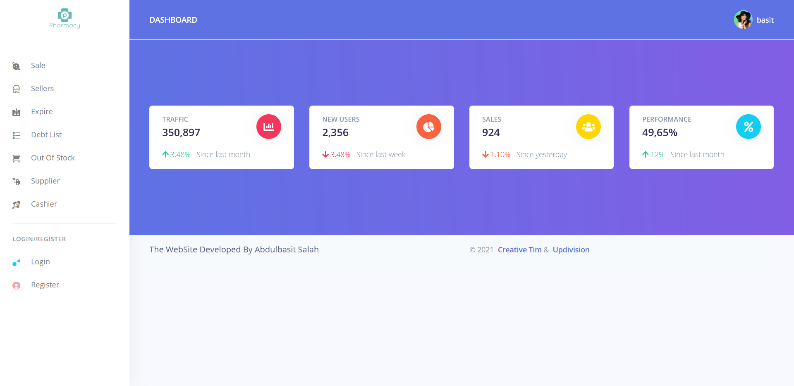
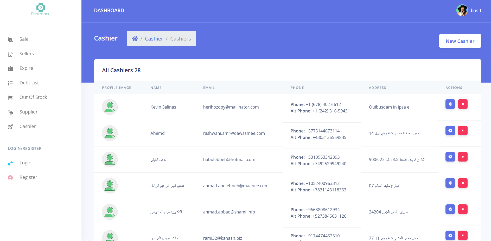
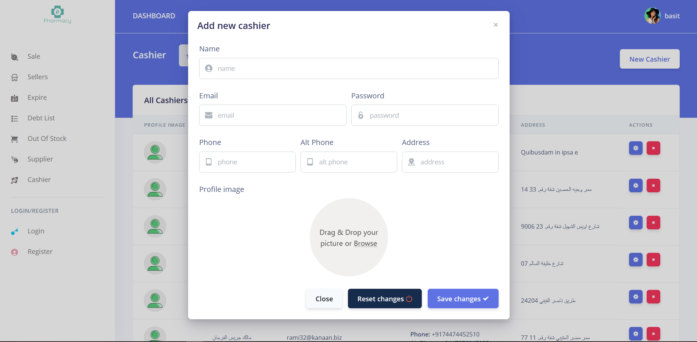

<h2 align="center">
Create Better Word
</h2>
 

# Larvel Pos Pharma
### a pos system for pharma (its testing project, not for client)

## How To Use the Repository

- clone the project
- create a file with name .env
- copy content of .env.example to .env
- set up your database connection in .env
- run $composer insatll
- run $php artisan migrate --seed (note --seed will fill the database with dummy data)
- you are good to go 😊

  
